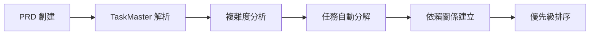

# Jesse HFT 系統完整整合方案

## 🎯 整合目標

構建一個高度自動化的開發協作流程，結合 TaskMaster AI + Claude Code + Codecov，實現從任務規劃到生產部署的全流程自動化。

## 📋 項目功能分析

### 核心系統組件

#### 1. Jesse 核心交易框架
- **位置**: `/core/jesse/`
- **功能**: 基礎量化交易框架
- **性能目標**: 支援傳統策略回測和實盤交易

#### 2. HFT 高頻交易優化層
- **位置**: `/core/jesse/services/hft_*.py`
- **功能**: 
  - Numba 優化指標計算 (40x 性能提升)
  - 超低延遲緩存系統 (<1ms)
  - 事件驅動架構 (<100μs 延遲)
  - 優化訂單管理 (O(1) 查找)
- **性能目標**: 交易延遲 <100μs

#### 3. DeFi MEV 套利模組
- **位置**: `/jesse-defi-mev/`
- **功能**:
  - 去中心化交易所連接器
  - MEV 機會檢測
  - 跨鏈套利策略
  - 錢包管理系統
- **性能目標**: MEV 機會捕獲率 >70%

#### 4. 智能合約層
- **位置**: `/contracts/`
- **功能**:
  - 套利智能合約
  - 閃電貸整合
  - 多 DEX 路由器
- **性能目標**: Gas 優化 >30%

## 🔧 三階段驗證測試進程

### Stage 1: 靜態代碼分析 (質量門)

#### 檢查項目
1. **代碼質量檢查**
   - Black 代碼格式化
   - isort 導入排序
   - Ruff + Flake8 代碼風格
   - MyPy 類型檢查

2. **安全掃描**
   - Bandit 安全漏洞掃描
   - Safety 依賴安全檢查
   - 智能合約安全審計 (Slither)

3. **代碼複雜度分析**
   - 圈複雜度檢查
   - 函數長度限制
   - 代碼重複檢測

#### 通過標準
```yaml
quality_gates:
  code_style: 100%  # 無風格錯誤
  type_coverage: 90%  # 類型覆蓋率
  security_issues: 0  # 零安全問題
  complexity_score: <10  # 低複雜度
```

### Stage 2: 功能測試 (測試門)

#### 測試層級
1. **單元測試**
   - 核心指標計算測試
   - HFT 組件單元測試
   - DeFi 連接器測試
   - 智能合約單元測試

2. **集成測試**
   - 系統間協作測試
   - 數據庫集成測試 (PostgreSQL + Redis)
   - 外部 API 集成測試
   - 多鏈集成測試

3. **端到端測試**
   - 完整交易流程測試
   - 套利策略端到端測試
   - Web 界面功能測試

#### 通過標準
```yaml
testing_gates:
  unit_test_coverage: 90%  # 單元測試覆蓋率
  integration_test_pass: 100%  # 集成測試通過率
  e2e_test_pass: 100%  # 端到端測試通過率
  test_execution_time: <5min  # 測試執行時間
```

### Stage 3: 性能與安全測試 (性能門)

#### 性能測試
1. **HFT 性能基準**
   - 指標計算延遲 <100μs
   - 訂單處理延遲 <100μs
   - 事件處理延遲 <100μs
   - 緩存命中率 >95%

2. **系統負載測試**
   - 並發處理能力測試
   - 內存使用限制測試
   - 數據庫壓力測試

3. **安全滲透測試**
   - API 安全測試
   - 智能合約攻擊測試
   - 私鑰安全測試

#### 通過標準
```yaml
performance_gates:
  hft_latency: <100  # μs
  memory_usage: <2GB  # 內存限制
  throughput: >10000  # ops/sec
  security_vulnerabilities: 0  # 零安全漏洞
```

## 🤖 自動化協作工作流程

### 階段 1: 任務規劃與分解

#### TaskMaster AI 角色
1. **PRD 解析與任務生成**
   ```bash
   # 基於 PRD 自動生成任務
   taskmaster parse-prd --research --num-tasks=25
   ```

2. **任務複雜度分析**
   ```bash
   # 分析任務複雜度並推薦分解
   taskmaster analyze-complexity --research --threshold=5
   ```

3. **智能任務分解**
   ```bash
   # 自動展開複雜任務為子任務
   taskmaster expand-all --research --force
   ```

#### 工作流程


### 階段 2: 自動化開發實施

#### Claude Code 整合
1. **智能代碼生成**
   - 基於任務描述自動生成代碼框架
   - 遵循項目代碼規範和最佳實踐
   - 自動生成單元測試

2. **代碼審查自動化**
   - 自動檢查代碼質量
   - 性能優化建議
   - 安全漏洞檢測

3. **文檔自動生成**
   - API 文檔自動更新
   - 代碼註釋自動生成
   - 架構圖自動更新

#### 實施流程
```bash
# 1. 獲取下一個任務
taskmaster next-task

# 2. 自動代碼實施 (Claude Code)
# - 分析任務需求
# - 生成代碼框架
# - 實施業務邏輯
# - 生成測試用例

# 3. 任務進度更新
taskmaster update-subtask --id="1.1" --prompt="代碼實施完成，準備進入測試階段"
```

### 階段 3: 三階段自動化驗證

#### GitHub Actions 工作流程增強

```yaml
# .github/workflows/integrated-validation.yml
name: 🚀 Integrated Validation Pipeline

on:
  push:
    branches: [main, develop]
  pull_request:
    branches: [main]

jobs:
  stage1-static-analysis:
    name: 📊 Stage 1 - Static Analysis
    runs-on: ubuntu-latest
    steps:
      - uses: actions/checkout@v4
      
      # Code Quality Checks
      - name: Code Quality Gate
        run: |
          black --check .
          isort --check-only .
          ruff check .
          mypy core/jesse/
          
      # Security Scanning
      - name: Security Gate
        run: |
          bandit -r core/jesse/
          safety check
          slither contracts/ --filter-paths "lib|test"
          
      # Quality Metrics Upload
      - name: Upload Quality Metrics
        uses: codecov/codecov-action@v3
        with:
          flags: quality
          
  stage2-functional-testing:
    name: 🧪 Stage 2 - Functional Testing
    needs: stage1-static-analysis
    runs-on: ubuntu-latest
    services:
      postgres:
        image: postgres:13
        env:
          POSTGRES_PASSWORD: jessepwd123
          POSTGRES_USER: jesse_user
          POSTGRES_DB: jesse_db
      redis:
        image: redis:6
        
    steps:
      - uses: actions/checkout@v4
      
      # Unit Tests
      - name: Unit Testing Gate
        run: |
          pytest core/tests/ --cov=jesse --cov-report=xml
          
      # Integration Tests
      - name: Integration Testing Gate
        run: |
          pytest tests/integration/ --cov-append --cov-report=xml
          
      # HFT Performance Tests
      - name: HFT Performance Tests
        run: |
          python -m jesse.services.hft_benchmark
          
      # Coverage Upload
      - name: Upload Coverage
        uses: codecov/codecov-action@v3
        with:
          files: ./coverage.xml
          flags: functional
          
  stage3-performance-security:
    name: ⚡ Stage 3 - Performance & Security
    needs: stage2-functional-testing
    runs-on: ubuntu-latest
    
    steps:
      - uses: actions/checkout@v4
      
      # Performance Benchmarks
      - name: Performance Gate
        run: |
          # HFT 延遲測試
          python scripts/test_hft_latency.py
          # 內存使用測試
          python scripts/test_memory_usage.py
          # 吞吐量測試
          python scripts/test_throughput.py
          
      # Security Penetration Tests
      - name: Security Gate
        run: |
          # API 安全測試
          python scripts/test_api_security.py
          # 智能合約安全測試
          mythril analyze contracts/
          
      # Final Validation
      - name: Final Validation Gate
        run: |
          python scripts/validate_all_gates.py
          
  codecov-analysis:
    name: 📈 Codecov Analysis
    needs: [stage1-static-analysis, stage2-functional-testing, stage3-performance-security]
    runs-on: ubuntu-latest
    
    steps:
      - name: Codecov Analysis
        uses: codecov/codecov-action@v3
        with:
          token: ${{ secrets.CODECOV_TOKEN }}
          files: ./coverage.xml
          flags: complete
          name: jesse-hft-coverage
          fail_ci_if_error: true
          
  taskmaster-update:
    name: 📋 TaskMaster Status Update
    needs: codecov-analysis
    runs-on: ubuntu-latest
    
    steps:
      - name: Update Task Status
        run: |
          # 自動更新任務狀態
          curl -X POST "https://api.taskmaster.ai/update" \
            -H "Authorization: Bearer ${{ secrets.TASKMASTER_TOKEN }}" \
            -d '{"task_id": "${{ github.event.head_commit.message }}", "status": "done"}'
```

### 階段 4: 自動化部署與監控

#### 部署管道
```yaml
deploy:
  name: 🚀 Automated Deployment
  needs: codecov-analysis
  if: github.ref == 'refs/heads/main'
  runs-on: ubuntu-latest
  
  steps:
    - name: Deploy to Staging
      run: |
        # 自動部署到測試環境
        docker build -t jesse-hft:latest .
        docker push registry/jesse-hft:latest
        
    - name: Production Deployment
      if: success()
      run: |
        # 生產環境部署
        kubectl apply -f k8s/production/
        
    - name: Post-Deployment Monitoring
      run: |
        # 部署後監控
        python scripts/monitor_deployment.py
```

## 📊 Codecov 整合配置

### Codecov 配置檔案

```yaml
# .codecov.yml
coverage:
  status:
    project:
      default:
        target: 90%
        threshold: 1%
        if_ci_failed: error
        
    patch:
      default:
        target: 80%
        threshold: 5%
        
  ignore:
    - "tests/"
    - "docs/"
    - "scripts/"
    
flags:
  quality:
    paths:
      - core/jesse/
  functional:
    paths:
      - core/jesse/
      - jesse-defi-mev/
  hft:
    paths:
      - core/jesse/services/hft_*.py
      - core/jesse/indicators/hft_*.py
      - core/jesse/store/hft_*.py
      
comment:
  layout: "reach,diff,flags,tree,reach"
  behavior: default
  require_changes: false
```

## 🔄 持續改進機制

### 自動化學習與優化

#### 1. 性能基準自動更新
```python
# scripts/auto_benchmark_update.py
class AutoBenchmarkUpdater:
    def update_performance_thresholds(self):
        """基於歷史數據自動調整性能閾值"""
        current_metrics = self.get_current_metrics()
        historical_data = self.get_historical_metrics()
        
        # 使用統計學方法優化閾值
        new_thresholds = self.calculate_optimal_thresholds(
            current_metrics, historical_data
        )
        
        self.update_ci_config(new_thresholds)
```

#### 2. 任務複雜度學習
```python
# taskmaster/complexity_learning.py
class ComplexityLearner:
    def learn_from_completed_tasks(self):
        """從已完成任務學習複雜度評估"""
        completed_tasks = self.get_completed_tasks()
        
        for task in completed_tasks:
            actual_time = task.completion_time
            estimated_complexity = task.estimated_complexity
            
            # 更新複雜度模型
            self.update_complexity_model(task, actual_time, estimated_complexity)
```

#### 3. 代碼質量趨勢分析
```python
# codecov/quality_analyzer.py
class QualityTrendAnalyzer:
    def analyze_quality_trends(self):
        """分析代碼質量趨勢並提出改進建議"""
        coverage_history = self.get_coverage_history()
        quality_metrics = self.get_quality_metrics()
        
        trends = self.calculate_trends(coverage_history, quality_metrics)
        recommendations = self.generate_recommendations(trends)
        
        return recommendations
```

## 🎯 成功指標

### 開發效率指標
```yaml
efficiency_metrics:
  task_completion_rate: >85%  # 任務完成率
  average_task_cycle_time: <2days  # 平均任務周期
  code_review_automation: >90%  # 代碼審查自動化率
  deployment_frequency: daily  # 部署頻率
  lead_time: <4hours  # 從代碼提交到生產的時間
```

### 質量指標
```yaml
quality_metrics:
  test_coverage: >90%  # 測試覆蓋率
  bug_detection_rate: >95%  # 預發布 bug 檢測率
  security_vulnerability_rate: 0  # 安全漏洞率
  performance_regression_rate: <5%  # 性能回歸率
  customer_satisfaction: >4.5/5  # 用戶滿意度
```

### 系統性能指標
```yaml
performance_metrics:
  hft_latency: <100μs  # HFT 延遲
  system_availability: >99.9%  # 系統可用性
  error_rate: <0.1%  # 錯誤率
  throughput: >10000ops/sec  # 吞吐量
  memory_efficiency: >60%  # 內存效率提升
```

## 📝 實施時間表

### Phase 1: 基礎整合 (Week 1-2)
- [ ] 配置 TaskMaster AI 任務管理
- [ ] 設置 Codecov 集成
- [ ] 實施三階段驗證流程
- [ ] 建立基礎自動化流程

### Phase 2: 高級自動化 (Week 3-4)
- [ ] Claude Code 深度整合
- [ ] 自動化代碼生成流程
- [ ] 智能化測試生成
- [ ] 性能監控自動化

### Phase 3: 智能優化 (Week 5-6)
- [ ] 機器學習驅動的質量預測
- [ ] 自適應性能閾值調整
- [ ] 智能任務分配
- [ ] 預測性維護系統

### Phase 4: 企業級部署 (Week 7-8)
- [ ] 生產環境自動化部署
- [ ] 多環境管理
- [ ] 災難恢復自動化
- [ ] 全面監控和警報系統

這個整合方案將實現真正的高度自動化協作，確保代碼質量、性能和安全性的同時，大幅提升開發效率。 